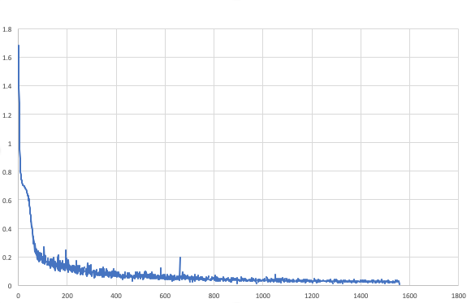

# CarND-Semantic-Segmentation-Project - Jose C. Marti
## Self-Driving Car Engineer Nanodegree Program.

## Overview

This is the 2nd project of the Term 3. In this project we have to write the python code that defines a Fully Convolutional Neural Network that has to be able to classify the pixels of a series of images to identify the drivable area.

## Description

The code is included in the main.py file.
A VGG-16 pre-trained is use for the first half of the network (encoder). 
The second half or decoder is defined in the code and is composed of transposed convolutions to upscale the feature maps and produce the segmentation image. 

In order to improve the performance we use skip connections. Adding convolutional layer 4 and 3 from previous VGG network to deconvolutional layers from 1st convolutional layer and from 1st skip layer respectively.

We use cross-entropy as the loss function with Adam optimizer.

The following hyperparameters were used:
- keep_prob: 0.5
- learning_rate: 0.0001
- epochs: 40
- batch_size: 8

## Project Specification

### Build the Neural Network

#### Does the project load the pretrained vgg model?
The function load_vgg is implemented correctly.

#### Does the project learn the correct features from the images?
The function layers is implemented correctly.

#### Does the project optimize the neural network?
The function optimize is implemented correctly.

#### Does the project train the neural network?	
The function train_nn is implemented correctly. The loss of the network should be printed while the network is training.

### Neural Network Training

#### Does the project train the model correctly?	
On average, the model decreases loss over time.



#### Does the project use reasonable hyperparameters?	
The number of epoch and batch size are set to a reasonable number.

#### Does the project correctly label the road?
The project labels most pixels of roads close to the best solution. The model doesn't have to predict correctly all the images, just most of them. A solution that is close to best would label at least 80% of the road and label no more than 20% of non-road pixels as road.


## Conclusion

Despite the small dataset used the result are quite impressive. 
Course lessons are complete and they accomplish the educational purpose of understanding the algorithms. However, once you try to translate this knowledge in to a piece of code things turn out to be a bit more difficult. The good thing is that the Quizzes and the Udacity walkthrough are very helpful (and key) to successfully accomplish this project.


J. C. Marti

-------------------------------

# Semantic Segmentation
### Introduction
In this project, you'll label the pixels of a road in images using a Fully Convolutional Network (FCN).

### Setup
##### GPU
`main.py` will check to make sure you are using GPU - if you don't have a GPU on your system, you can use AWS or another cloud computing platform.
##### Frameworks and Packages
Make sure you have the following is installed:
 - [Python 3](https://www.python.org/)
 - [TensorFlow](https://www.tensorflow.org/)
 - [NumPy](http://www.numpy.org/)
 - [SciPy](https://www.scipy.org/)

You may also need [Python Image Library (PIL)](https://pillow.readthedocs.io/) for SciPy's `imresize` function.

##### Dataset
Download the [Kitti Road dataset](http://www.cvlibs.net/datasets/kitti/eval_road.php) from [here](http://www.cvlibs.net/download.php?file=data_road.zip).  Extract the dataset in the `data` folder.  This will create the folder `data_road` with all the training a test images.

### Start
##### Implement
Implement the code in the `main.py` module indicated by the "TODO" comments.
The comments indicated with "OPTIONAL" tag are not required to complete.
##### Run
Run the following command to run the project:
```
python main.py
```
**Note:** If running this in Jupyter Notebook system messages, such as those regarding test status, may appear in the terminal rather than the notebook.

#### Example Outputs
Here are examples of a sufficient vs. insufficient output from a trained network:

Sufficient Result          |  Insufficient Result
:-------------------------:|:-------------------------:
  |  

### Submission
1. Ensure you've passed all the unit tests.
2. Ensure you pass all points on [the rubric](https://review.udacity.com/#!/rubrics/989/view).
3. Submit the following in a zip file.
 - `helper.py`
 - `main.py`
 - `project_tests.py`
 - Newest inference images from `runs` folder  (**all images from the most recent run**)
 
### Tips
- The link for the frozen `VGG16` model is hardcoded into `helper.py`.  The model can be found [here](https://s3-us-west-1.amazonaws.com/udacity-selfdrivingcar/vgg.zip).
- The model is not vanilla `VGG16`, but a fully convolutional version, which already contains the 1x1 convolutions to replace the fully connected layers. Please see this [post](https://s3-us-west-1.amazonaws.com/udacity-selfdrivingcar/forum_archive/Semantic_Segmentation_advice.pdf) for more information.  A summary of additional points, follow. 
- The original FCN-8s was trained in stages. The authors later uploaded a version that was trained all at once to their GitHub repo.  The version in the GitHub repo has one important difference: The outputs of pooling layers 3 and 4 are scaled before they are fed into the 1x1 convolutions.  As a result, some students have found that the model learns much better with the scaling layers included. The model may not converge substantially faster, but may reach a higher IoU and accuracy. 
- When adding l2-regularization, setting a regularizer in the arguments of the `tf.layers` is not enough. Regularization loss terms must be manually added to your loss function. otherwise regularization is not implemented.

### Why Layer 3, 4 and 7?
In `main.py`, you'll notice that layers 3, 4 and 7 of VGG16 are utilized in creating skip layers for a fully convolutional network. The reasons for this are contained in the paper [Fully Convolutional Networks for Semantic Segmentation](https://arxiv.org/pdf/1605.06211.pdf).

In section 4.3, and further under header "Skip Architectures for Segmentation" and Figure 3, they note these provided for 8x, 16x and 32x upsampling, respectively. Using each of these in their FCN-8s was the most effective architecture they found. 

### Optional sections
Within `main.py`, there are a few optional sections you can also choose to implement, but are not required for the project.

1. Train and perform inference on the [Cityscapes Dataset](https://www.cityscapes-dataset.com/). Note that the `project_tests.py` is not currently set up to also unit test for this alternate dataset, and `helper.py` will also need alterations, along with changing `num_classes` and `input_shape` in `main.py`. Cityscapes is a much more extensive dataset, with segmentation of 30 different classes (compared to road vs. not road on KITTI) on either 5,000 finely annotated images or 20,000 coarsely annotated images.
2. Add image augmentation. You can use some of the augmentation techniques you may have used on Traffic Sign Classification or Behavioral Cloning, or look into additional methods for more robust training!
3. Apply the trained model to a video. This project only involves performing inference on a set of test images, but you can also try to utilize it on a full video.
 
### Using GitHub and Creating Effective READMEs
If you are unfamiliar with GitHub , Udacity has a brief [GitHub tutorial](http://blog.udacity.com/2015/06/a-beginners-git-github-tutorial.html) to get you started. Udacity also provides a more detailed free [course on git and GitHub](https://www.udacity.com/course/how-to-use-git-and-github--ud775).

To learn about REAMDE files and Markdown, Udacity provides a free [course on READMEs](https://www.udacity.com/courses/ud777), as well. 

GitHub also provides a [tutorial](https://guides.github.com/features/mastering-markdown/) about creating Markdown files.
